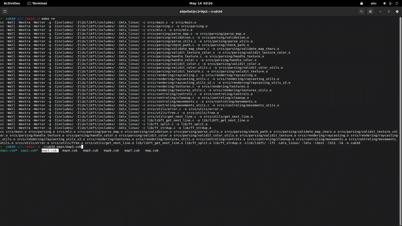

# cub3D - A First-Person Raycaster Engine

## 🕹️ Project Overview
**cub3D** is a graphics project at **42 School** that explores the foundations of 3D rendering. Inspired by the legendary *Wolfenstein 3D*, this project involves building a 3D game engine from scratch using **C**, **Raycasting** principles, and the **MinilibX** library.

The goal was to transform a 2D map into a smooth, navigable 3D environment, handling everything from wall textures and floor/ceiling coloring to player movement and collision detection.

---

## 🚀 Key Features
* **Real-time 3D Rendering:** Uses Raycasting to simulate a 3D perspective at a smooth frame rate.
* **Texture Mapping:** Precise wall texturing based on the orientation (North, South, East, West).
* **Interactive Controls:** Fluid movement using `WASD` and 90°/smooth camera rotation via arrow keys.
* **Collision Detection:** Robust logic to prevent the player from walking through walls.
* **Map Parsing:** A custom parser that validates `.cub` configuration files, checking for map closure, valid textures, and color codes.

---

## 🛠️ The Technical Challenge
Building a 3D engine in C without a modern graphics API requires more than just coding; it requires math.

### 📐 Raycasting Logic
The engine works by "casting" a ray for every vertical slice of the screen (X-axis). 
* Calculated the distance to the nearest wall using the **DDA (Digital Differential Analyzer)** algorithm.
* Applied **Trigonometric corrections** to prevent the "fisheye" effect (distorted wall height at the edges of the screen).
* Calculated the specific `texX` and `texY` coordinates to map `.xpm` textures onto the walls accurately.

### 💾 Memory & Performance
* **Resource Management:** Handled all graphical assets and map data with strict memory management to ensure zero leaks.
* **Event Loop:** Integrated the MinilibX hooks to manage keyboard inputs and window rendering cycles efficiently.

---

## 📦 Installation & Usage

### Prerequisites
* A Unix-based system (Linux/macOS).
* `gcc` or `clang` compiler.
* `make` utility.
* `MinilibX` dependencies (X11/AppKit).

### Setup
1.  **Clone the repository:**
    ```bash
    git clone https://github.com/abdejl/cub3d.git
    cd cub3d
    ```
2.  **Compile the project:**
    ```bash
    make
    ```
3.  **Run a map:**
    ```bash
    ./cub3D maps/map3.cub
    ```

---

## 📸 Preview


---

## 🎓 Learning Outcomes
This project was a deep dive into:
1.  **Low-level Graphics:** Understanding how pixels are pushed to the screen buffer.
2.  **Mathematics for Programming:** Applying linear algebra and trigonometry to solve spatial problems.
3.  **Project Architecture:** Organizing a complex codebase with multiple modules (Parsing, Rendering, Logic).

---

### 👨‍💻 Author
**abderrahim jellal** *Software Engineering Student at 42* [LinkedIn](https://www.linkedin.com/in/abderrahim-jellal-397b2b278/) | [GitHub](https://github.com/abdejl)
